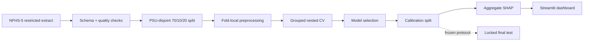

# NFHS-5 Anaemia Severity ML


**Survey-aware multiclass machine learning for anaemia severity among women aged 15–49 using NFHS-5 India.**

[Live dashboard](https://nfhs5-anaemia-severity-ml-production.up.railway.app) · [Development results](docs/development_results.md) · [Model card](docs/model_card.md) · [Research protocol](docs/research_protocol.md)

## Why I built this

Most tabular ML examples assume independent rows and random train/test splits. NFHS-5 is different: observations are clustered by survey design, the target is strongly imbalanced, and several variables can leak outcome information.

I built this project to treat those constraints as part of the ML system rather than as an afterthought. The result is a reproducible pipeline with PSU-disjoint validation, fold-local preprocessing, probability calibration, aggregate explainability, automated tests, and a public dashboard that never exposes restricted respondent-level data.

## Dataset and target

| Item | Value |
|---|---|
| Survey | NFHS-5 India, 2019–2021 |
| Analytic records | 724,115 |
| Coverage | 36 States/UTs, 707 districts |
| Source variables | 40 |
| Target | None / Mild / Moderate / Severe anaemia |
| Development / calibration / locked test | 70% / 10% / 20% by PSU |

The primary label comes from NFHS `v457`. Adjusted haemoglobin (`v456`) is used only for outcome audit/sensitivity work and is never a predictor. Raw NFHS/DHS microdata are not distributed in this repository.

## Pipeline



Key design choices:

- composite PSU grouping prevents cluster overlap between partitions;
- preprocessing is fitted inside training folds only;
- numeric features use median imputation plus missingness indicators;
- categorical missingness is represented explicitly;
- model selection uses grouped nested cross-validation;
- probability calibration is performed on a separate calibration partition;
- the final test remains locked until the confirmatory research protocol is executed.

## Development results

These are **development/calibration estimates, not final-test results**.

| Model | Macro-F1 | Balanced accuracy | Severe recall |
|---|---:|---:|---:|
| Multinomial logistic regression | 0.270 ± 0.002 | 0.332 | 0.452 |
| Random forest | **0.325 ± 0.002** | 0.332 | 0.125 |
| LightGBM | 0.312 ± 0.001 | 0.360 | 0.368 |

Random forest was selected by the prespecified primary metric (macro-F1). Its low severe-class recall is an important limitation and is one reason this project is presented as a research/engineering system rather than a clinical screening tool.

Calibration on the held-out calibration partition improved:

- weighted log loss: **1.252 → 1.211**
- multiclass Brier score: **0.690 → 0.678**
- expected calibration error: **0.066 → 0.013**

Aggregate SHAP analysis highlighted BMI, age, and education among the leading model features. These are model associations, not causal effects.

## Engineering highlights

- **Leakage-safe ML:** strict predictor exclusions and fold-local transformations
- **Survey-aware validation:** PSU-disjoint splits and grouped nested CV
- **Reproducibility:** configuration/data fingerprints and resumable checkpoints
- **Model governance:** locked-test guardrails and explicit release boundaries
- **Public-data safety:** CI audit blocks restricted data, serialized models, secrets, and row-level outputs
- **Deployment:** Dockerized Streamlit app running on Railway
- **Quality gates:** Ruff, pytest/coverage, notebook cleanliness checks, Docker build

## Agentic Research Copilot

The live dashboard includes a policy-gated research copilot for model comparison, selection rationale, calibration, SHAP, release readiness and next-experiment planning.

The copilot follows a deliberately constrained architecture:

`request → deterministic router → optional LLM fallback → approved intent → deterministic tool → policy gate → execution trace → evidence-backed response`

Known requests stay local. V4 adds a provider-agnostic external fallback for ambiguous requests with a short timeout, closed-intent validation, an in-process circuit breaker, fail-closed behavior, and non-persistent token/latency telemetry. The external planner receives only the user query and allowed intent names—never NFHS rows, project evidence, model artifacts, or validation data. V3's 20-case golden evaluation suite and CI quality gate remain active.

## Tech stack

**Python · pandas · scikit-learn · LightGBM · Optuna · SHAP · Pydantic · Streamlit · Docker · GitHub Actions · Railway**

## Repository structure

```text
.
├── app.py                 # public Streamlit dashboard
├── configs/               # data + validation contracts
├── data/README.md         # restricted-data handling
├── demo/                  # disclosure-checked aggregate demo assets
├── docs/                  # protocol, results, model card, engineering notes
├── notebooks/             # clean research notebook
├── scripts/               # public-repository safety audit
├── src/anaemia_ml/
│   ├── agents/            # typed agent planner, tools and governance
│   └── ...                # reusable ML pipeline
├── tests/                 # unit/integration/leakage tests
├── Dockerfile
└── pyproject.toml
```

## Run locally

Python 3.12:

```bash
git clone https://github.com/rjraunak04/nfhs5-anaemia-severity-ml.git
cd nfhs5-anaemia-severity-ml

python -m venv .venv
python -m pip install --upgrade pip
python -m pip install -e ".[dev]"

python scripts/public_repo_audit.py
python -m pytest -q
streamlit run app.py
```

Docker:

```bash
docker build -t nfhs5-anaemia-severity-ml .
docker run --rm -p 8501:8501 nfhs5-anaemia-severity-ml
```

## Documentation

- [Development results](docs/development_results.md) — model comparison, calibration and aggregate SHAP evidence
- [Model card](docs/model_card.md) — intended use, limitations and responsible-use boundary
- [Research protocol](docs/research_protocol.md) — prespecified statistical and validation design
- [Engineering notes](docs/engineering.md) — CI, reproducibility, deployment and public-data safeguards

## Scope and responsible use

This is a research and ML-engineering project, not a diagnostic service. It must not replace haemoglobin testing or guide treatment. The locked final test, cluster-bootstrap confidence intervals, subgroup/geographic robustness and external validation remain separate confirmatory research steps.

## Author

**Ankur Kumar Jaiswal** · [GitHub](https://github.com/rjraunak04)

NFHS/DHS participant-level data remain governed by the data provider's access agreement. Public visibility of this repository does not grant rights to redistribute the underlying survey data.
