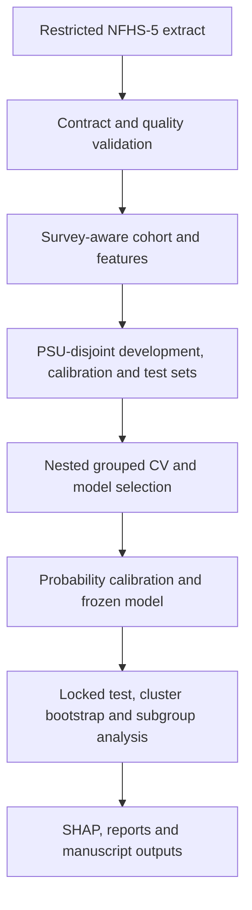

# NFHS-5 Anaemia Severity ML


Survey-aware, leakage-resistant machine learning for four-class anaemia severity classification among women aged 15–49 using India’s National Family Health Survey (NFHS-5).

> **Project status:** The public software/portfolio release is complete and CI-gated. Confirmatory research validation remains intentionally separate: the protocol-defined locked test is still untouched, so no final or clinical performance claim is made.

## Project overview

Anaemia is a major public-health concern in India, but identifying women at risk of severe disease from large household surveys is methodologically challenging. The data are imbalanced, observations are clustered by survey design, several variables are not valid predictors, and conventional random splitting can produce optimistic results.

This repository provides an end-to-end research-engineering pipeline that combines:

- a theory-driven 40-variable NFHS-5 data contract;
- survey weights, primary sampling units (PSUs), strata, states, and districts;
- PSU-disjoint development, calibration, and final-test partitions;
- fold-local preprocessing and imbalance handling;
- calibrated multiclass and ordinal models;
- cluster-bootstrap uncertainty, explainability, and subgroup evaluation;
- reproducible checkpoints for long-running Google Colab experiments.

## Research question

> How accurately and reliably can anaemia severity among Indian women aged 15–49 be classified from non-haemoglobin NFHS-5 predictors while respecting the complex survey design and preventing target leakage?

### Study objectives

1. Estimate survey-weighted anaemia prevalence and subgroup patterns.
2. Compare interpretable baselines with tree-based multiclass models.
3. Prioritize macro-level performance and severe-class detection.
4. Calibrate predicted probabilities on data not used for model fitting.
5. Quantify uncertainty with PSU-aware resampling.
6. Evaluate robustness across states and key demographic subgroups.
7. Produce reproducible research outputs and a portfolio-quality ML codebase.

## Dataset

| Item | Protocol specification |
|---|---|
| Survey | NFHS-5 India, 2019–2021 |
| Study population | Women aged 15–49 |
| Expected analytic records | 724,115 |
| Selected raw variables | 40 |
| Geographic coverage | 36 States/UTs and 707 districts |
| Survey structure | Weights, PSUs, strata, state and district identifiers |
| Primary outcome | Four-class anaemia severity from `v457` |
| Sensitivity field | Adjusted haemoglobin `v456` (never used as a predictor) |

The machine-readable schema is defined in [`configs/data_contract.yaml`](configs/data_contract.yaml). Variable roles and restricted-data handling are documented in [`data/README.md`](data/README.md).

### Outcome coding

| NFHS `v457` code | Anaemia category | Model label |
|---:|---|---:|
| 4 | None | 0 |
| 3 | Mild | 1 |
| 2 | Moderate | 2 |
| 1 | Severe | 3 |

`v456`, `v457`, identifiers, survey-weight variables, and evaluation-only geography are excluded from leakage-safe predictor sets as appropriate.

### Predictor domains

- **Socio-demographic:** age, residence, marital status, religion, caste, wealth and education.
- **Reproductive health:** parity, recent births, age at first birth, pregnancy, pregnancy termination, contraception, breastfeeding and amenorrhoea.
- **Anthropometry and access:** BMI, healthcare barriers, water, sanitation, cooking fuel and health insurance.
- **Nutrition and comorbidity:** diabetes and selected food-frequency variables.

Two analysis variants are planned:

- **India policy model:** may use state-level context.
- **Transportable risk model:** excludes state and district as predictors and uses them only for evaluation.

## Protocol-specified workflow



Key safeguards:

- 70/10/20 development, calibration, and test allocation with no PSU overlap.
- Nested grouped cross-validation inside the development partition.
- Imputation, encoding, scaling, and resampling fitted inside each training fold.
- Final test data used once after model selection and calibration are frozen.
- 500-replicate PSU-within-strata bootstrap for 95% confidence intervals.
- Held-out SHAP analysis and state/subgroup robustness checks.
- Dataset/configuration fingerprints and resumable stage checkpoints.

The full analysis plan is maintained in [`docs/research_protocol.md`](docs/research_protocol.md).

## Models and evaluation

### Planned model families

- Dummy and survey-aware descriptive baselines
- Multinomial logistic regression
- Ordinal logistic regression
- Random forest
- LightGBM
- XGBoost
- CatBoost
- Limited calibrated ensemble selected without test-set feedback

Class imbalance strategies will be compared rather than stacked blindly: no balancing, class weighting, fold-local SMOTENC, and balanced ensembles.

### Primary metrics

- Macro-F1
- Severe-class recall
- Severe-class precision–recall AUC
- Balanced accuracy

### Secondary metrics

- Macro AUROC and weighted-F1
- Multiclass Brier score, log loss, and expected calibration error
- Quadratic-weighted kappa and ordinal mean absolute error
- Stakeholder-defined cost sensitivity
- Subgroup and geographic performance gaps

## Engineering and reproducibility

| Environment | Responsibility |
|---|---|
| Local VS Code | Package development, unit tests, linting and Git workflow |
| Google Colab | Large-data EDA, model training, SHAP and bootstrap jobs |
| Google Drive | Restricted input data and resumable experiment checkpoints |
| GitHub | Versioned source code, documentation, reviews and CI |

Long-running stages will write hash-validated checkpoints. A restarted Colab runtime may reuse only artifacts produced by the same dataset, feature schema, configuration, split, and pipeline version.

### Public release verification

The public repository is protected by automated disclosure and deployability gates:

- `python scripts/public_repo_audit.py` rejects restricted data/model artifacts, common secret formats, row-level dashboard keys and local machine paths.
- GitHub Actions runs the public audit, Ruff, the full pytest/coverage suite, notebook-cleanliness validation and a Docker image build.
- [Public release status](docs/final_status.md) separates completed software engineering from intentionally gated confirmatory research.
- [Deployment guide](docs/deployment.md) documents Streamlit Community Cloud; `render.yaml` and the root `Dockerfile` provide a container deployment path.

### Repository map

```text
configs/                    Machine-readable experiment and data contracts
data/README.md              Restricted-data policy and local placement rules
docs/research_protocol.md   Statistical and modelling protocol
src/anaemia_ml/             Reusable Python package
tests/                      Unit, schema and leakage tests
notebooks/                  Auditable research notebooks
reports/                    Generated tables and figures (not raw data)
pyproject.toml              Dependencies and development-tool configuration
```

## Local setup

Python 3.12 is required.

```powershell
git clone https://github.com/rjraunak04/nfhs5-anaemia-severity-ml.git
cd nfhs5-anaemia-severity-ml

python -m venv .venv
Set-ExecutionPolicy -Scope Process -ExecutionPolicy Bypass
.\.venv\Scripts\Activate.ps1

python -m pip install --upgrade pip
python -m pip install -e ".[dev]"
```

For the complete research stack:

```powershell
python -m pip install -e ".[modeling,visualization,notebook,dev]"
```

### One-command engineering smoke run

After installing the development dependencies, verify the complete ML path with deterministic synthetic data:

```powershell
anaemia-train --smoke --output-directory runs/day1-smoke
```

This command validates the 40-column contract, builds PSU-disjoint partitions, compares Logistic Regression, Random Forest, and LightGBM with grouped nested CV, refits the development winner, and writes an integrity-checked model artifact. It does not evaluate calibration or locked-test data and does not produce a research performance claim.

### Run the public dashboard with Docker

```powershell
python scripts/public_repo_audit.py
docker build -t nfhs5-anaemia-severity-ml .
docker run --rm -p 8501:8501 nfhs5-anaemia-severity-ml
```

Open `http://localhost:8501`. The image contains only the application, package code, configuration needed by the app and disclosure-checked aggregate demo/results data; restricted NFHS/DHS microdata and local model artifacts are excluded from the build context.

Before starting feature work, create a branch from an updated `main` branch:

```powershell
git switch main
git pull --ff-only origin main
git switch -c feat/<short-task-name>
```

## Data access and governance

NFHS/DHS participant-level data are **not included in this repository** and must not be committed, attached to issues, or published in releases. Authorized researchers should obtain access from the official data provider and keep raw and reduced extracts outside Git history.

The repository may contain only:

- schemas and variable dictionaries;
- synthetic fixtures;
- aggregate, disclosure-checked outputs;
- code, configuration, tests, and documentation.

Local data, model artifacts, checkpoints, caches, credentials, and virtual environments are protected through `.gitignore`.

## Current roadmap

- [x] Repository and restricted-data governance
- [x] Prespecified research protocol
- [x] Exact 40-variable data contract
- [x] Python package and development-tool foundation
- [x] Executable data-contract validation and automated tests
- [ ] Confirmatory survey-weighted descriptive/uncertainty reporting
- [x] Cohort and leakage-safe feature pipeline
- [x] PSU-disjoint split generation
- [x] Deterministic logistic-regression, random-forest, and LightGBM registry
- [x] Nested grouped selection with resumable tuning checkpoints
- [x] Group-cross-fitted temperature selection on calibration data
- [x] Aggregate-only SHAP reporting on calibration observations
- [x] Development model card and reproducibility/results report
- [x] Recruiter-facing aggregate dashboard and deployment configuration
- [x] Docker packaging and automated public-repository safety audit
- [ ] Confirmatory research release: state-held-out validation, single-use locked test, cluster-bootstrap uncertainty, subgroup/geographic robustness, and manuscript finalization

## Day 2: calibration, SHAP, and dashboard

The Day 2 command extends the development workflow without opening the locked
test partition. It compares the three registered models with grouped nested CV,
fits the selected model on development data, selects temperature scaling with
PSU-disjoint cross-fitting on calibration data, saves an integrity-checked
calibrated artifact, and immediately aggregates SHAP values to raw predictors.

Install the development dependencies and run the public-safe synthetic engineering
demo:

```powershell
python -m pip install -e ".[dev]"
anaemia-day2 --smoke --output-directory runs/day2-smoke
streamlit run app.py
```

The bundled dashboard explicitly labels this run as synthetic and hides its
synthetic performance scores from the default recruiter view. It demonstrates
that all pipeline paths execute; it does **not** claim performance on NFHS
participants.

For a restricted real-data development run, first create the exact validated
40-column extract described by `configs/data_contract.yaml`, keep it outside
Git, and run:

```powershell
$env:ANAEMIA_CODE_VERSION = git rev-parse --short HEAD
anaemia-day2 `
  --data data/restricted/nfhs5_anaemia_modeling_extract.parquet `
  --output-directory runs/day2-nfhs `
  --code-version $env:ANAEMIA_CODE_VERSION
```

Day 2 writes only integrity-checked model files and aggregate JSON reports:

```text
runs/day2-nfhs/
├── development/development_report.json
├── development/model/manifest.json
├── calibrated_model/manifest.json
├── calibration_report.json
├── explainability_report.json
└── portfolio_summary.json
```

`portfolio_summary.json` is the only input accepted by the dashboard. Its
schema rejects raw rows, respondent or PSU identifiers, split indices,
predictions, probabilities, labels, and survey weights. Calibration and SHAP
remain development-stage evidence; final performance claims stay disabled
until every locked-test gate in `configs/validation.yaml` is satisfied.

## Day 3: recruiter/research release

Day 3 packages the verified development evidence into a portfolio-ready release without weakening the study protocol. The default Streamlit view uses only disclosure-checked aggregate NFHS development/calibration results; a separate synthetic mode is retained for engineering demonstrations.

Release assets:

- [Final public-release status](docs/final_status.md) — what is complete for software/recruiter review and what remains intentionally research-gated.
- [Development results](docs/development_results.md) — provenance, PSU-disjoint split sizes, grouped nested-CV estimates, calibration diagnostics and SHAP summary.
- [Model card](docs/model_card.md) — intended use, non-clinical scope, limitations and release policy.
- [Deployment guide](docs/deployment.md) — local and Streamlit Community Cloud verification steps.
- [Release checklist](docs/release_checklist.md) — completed engineering gates and research gates that intentionally remain closed.
- [Citation metadata](CITATION.cff) — software citation for this development release.

The release deliberately does **not** include raw NFHS/DHS records, respondent-level predictions, fitted model binaries, local checkpoints, secrets or locked-test results. The locked test remains untouched until the protocol-defined final evaluation stage.

## Responsible use and limitations

- This is a research project, not a medical device or diagnostic service.
- Predictions must not be used to decide treatment or replace haemoglobin testing.
- NFHS-5 is cross-sectional; predictive associations are not causal effects.
- Internal validation does not establish prospective clinical usefulness.
- Fairness, calibration, geographic robustness, and external validation are required before any deployment claim.
- Numerical misclassification costs are stakeholder-defined sensitivity scenarios, not WHO-prescribed treatment rules.

Reporting is being aligned with [TRIPOD+AI](https://www.bmj.com/content/385/bmj-2023-078378), [PROBAST+AI](https://www.bmj.com/content/388/bmj-2024-082505), and [DHS survey-analysis guidance](https://dhsprogram.com/data/Guide-to-DHS-Statistics/Analyzing_DHS_Data.htm).

## Results and citation

No final performance results, DOI, or publication claim is reported yet. This section will be updated only after the frozen pipeline completes the locked-test analysis and the outputs pass reproducibility checks.

A development `CITATION.cff` and model card are included. A final research release tag, DOI and paper citation will be added only after the locked-test, uncertainty and robustness gates are complete.

## Author

**Ankur Kumar Jaiswal** · [GitHub profile](https://github.com/rjraunak04)

No open-source software license is granted by this repository at present; public visibility is for research transparency and portfolio review and does not by itself grant reuse rights. NFHS/DHS data remain governed by the data provider’s access agreement.
